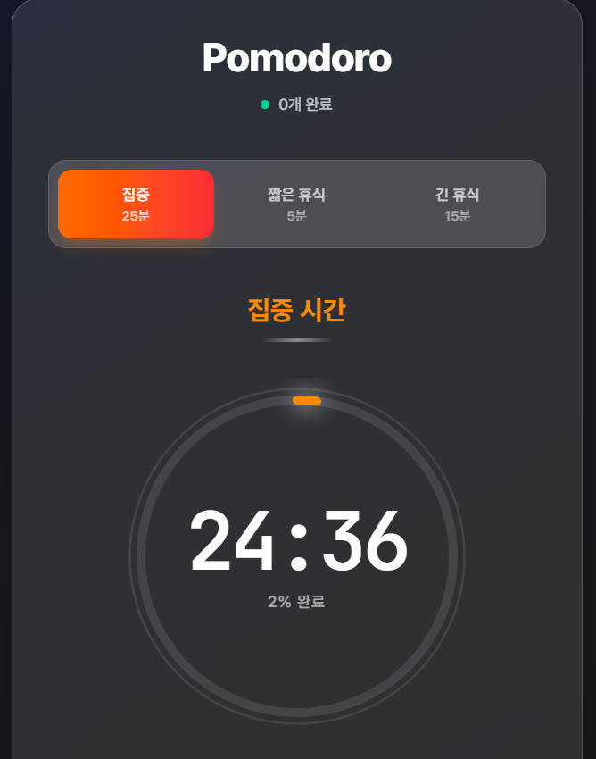

# 🍅 포모도로 타이머

Next.js, TypeScript, Tailwind CSS로 제작된 모던하고 세련된 포모도로 타이머입니다. 검증된 25분 집중 + 5분 휴식 기법으로 생산성을 높여보세요.



## ✨ 주요 기능

- **클래식 포모도로 기법**: 25분 집중 + 5분 휴식 사이클
- **모던 글래스모피즘 디자인**: 글래스 효과가 적용된 아름다운 다크 테마
- **시각적 진행률 링**: 애니메이션이 적용된 원형 진행률 표시기
- **세션 관리**: 집중, 짧은 휴식, 긴 휴식 간편 전환
- **자동 진행**: 세션 완료 시 자동으로 다음 단계로 전환
- **반응형 디자인**: 모든 화면 크기에서 완벽하게 작동
- **한글 폰트 지원**: Pretendard 폰트로 최적화된 한글 표시

## 🚀 기술 스택

- **프레임워크**: Next.js 14 (App Router)
- **언어**: TypeScript
- **스타일링**: Tailwind CSS
- **아이콘**: Lucide React
- **폰트**: Inter, JetBrains Mono, Pretendard

## 🎯 세션 유형

| 세션 유형 | 시간 | 설명 |
|----------|------|------|
| 집중 시간 | 25분 | 깊은 집중 작업 시간 |
| 짧은 휴식 | 5분 | 집중 세션 사이의 짧은 휴식 |
| 긴 휴식 | 15분 | 4번의 집중 세션 후 긴 휴식 |

## 🛠️ 설치 및 실행

### 필수 요구사항
- Node.js 18+ 
- npm 또는 yarn 또는 pnpm

### 클론 및 설치
```bash
# 저장소 클론
git clone https://github.com/yourusername/pomodoro-timer.git
cd pomodoro-timer

# 의존성 설치
npm install
# 또는
yarn install
# 또는
pnpm install
```

### 개발 환경 실행
```bash
# 개발 서버 시작
npm run dev
# 또는
yarn dev
# 또는
pnpm dev
```

브라우저에서 [http://localhost:3000](http://localhost:3000)을 열어주세요.

### 프로덕션 빌드
```bash
# 애플리케이션 빌드
npm run build
# 또는
yarn build
# 또는
pnpm build

# 프로덕션 서버 시작
npm start
# 또는
yarn start
# 또는
pnpm start
```

## 📁 프로젝트 구조

```
pomodoro-timer/
├── src/
│   ├── app/
│   │   ├── layout.tsx
│   │   ├── page.tsx
│   │   └── globals.css
│   ├── components/
│   │   ├── PomodoroTimer.tsx     # 메인 타이머 컴포넌트
│   │   ├── TimerDisplay.tsx      # 시각적 타이머 표시
│   │   └── TimerControls.tsx     # 컨트롤 버튼들
│   ├── hooks/
│   │   └── useTimer.ts           # 타이머 로직 훅
│   ├── types/
│   │   └── timer.ts              # TypeScript 타입 정의
│   └── utils/
│       ├── constants.ts          # 앱 상수
│       └── time.ts               # 시간 유틸리티 함수
├── public/
├── README.md
└── package.json
```

## 🎨 디자인 특징

- **다크 글래스모피즘**: 투명도와 백드롭 블러 효과의 모던한 디자인
- **네온 글로우**: 진행률 링과 버튼의 은은한 발광 효과
- **부드러운 애니메이션**: cubic-bezier 이징을 사용한 CSS 트랜지션
- **마이크로 인터랙션**: 호버 효과와 버튼 피드백
- **그라디언트 버튼**: 세션 유형별 색상 구분된 그라디언트

## 🔧 커스터마이징

### 타이머 시간 변경
`src/utils/constants.ts`에서 상수를 수정하세요:

```typescript
export const TIMER_SETTINGS = {
  POMODORO: 25 * 60,    // 25분
  SHORT_BREAK: 5 * 60,  // 5분
  LONG_BREAK: 15 * 60,  // 15분
} as const;
```

### 색상 변경
컴포넌트 파일에서 색상 스키마를 수정할 수 있습니다:
- `PomodoroTimer.tsx` - 세션 버튼 색상
- `TimerDisplay.tsx` - 진행률 링 색상
- `TimerControls.tsx` - 컨트롤 버튼 색상

## 📱 반응형 디자인

타이머는 다음 환경에서 완벽하게 작동합니다:
- 데스크톱 컴퓨터
- 태블릿
- 모바일 폰
- 다양한 화면 방향

## 🌟 향후 개선 사항

- [ ] 알림음 추가
- [ ] 브라우저 알림
- [ ] 세션 통계
- [ ] 사용자 정의 시간 설정
- [ ] 다크/라이트 테마 토글
- [ ] 키보드 단축키
- [ ] 설정 로컬 저장

## 🤝 기여하기

1. 저장소를 포크하세요
2. 기능 브랜치를 생성하세요 (`git checkout -b feature/amazing-feature`)
3. 변경사항을 커밋하세요 (`git commit -m 'Add some amazing feature'`)
4. 브랜치에 푸시하세요 (`git push origin feature/amazing-feature`)
5. Pull Request를 열어주세요

## 📄 라이선스

이 프로젝트는 MIT 라이선스 하에 배포됩니다. 자세한 내용은 [LICENSE](LICENSE) 파일을 참조하세요.

## 💝 감사의 말

- Francesco Cirillo가 창안한 포모도로 기법®에서 영감을 받았습니다
- 모던 생산성 앱들의 디자인에서 영감을 얻었습니다
- Pretendard 폰트로 한글 타이포그래피를 최적화했습니다

---

**Made by devdduddu ❤️**

> 30일 챌린지의 일환: 매일 하나씩 서비스를 만들고 출시하기!