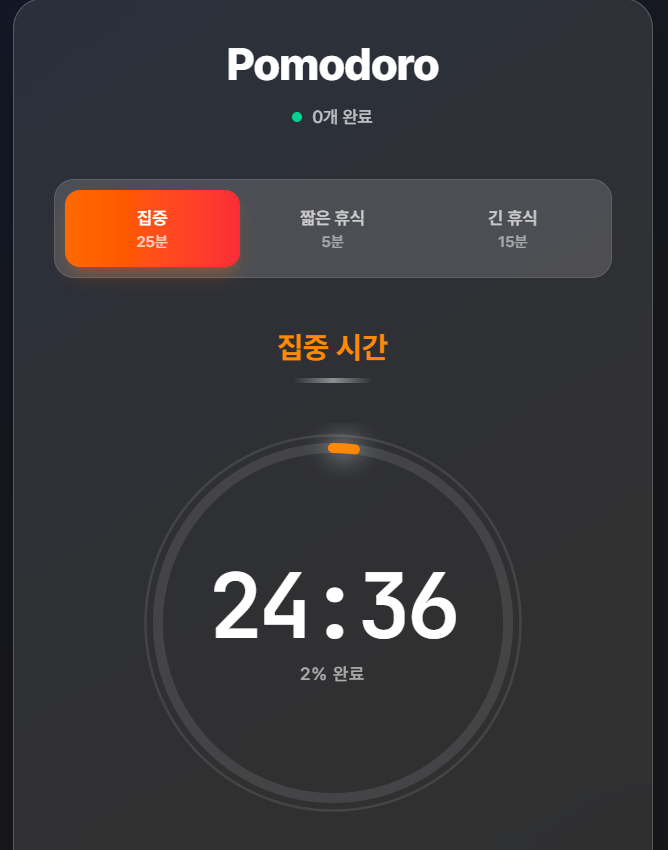

# 포모도로 타이머 | Pomodoro Timer

> 25분 집중 + 5분 휴식, 검증된 포모도로 기법으로 생산성을 높여보세요.

[](https://pomodoro-self-zeta.vercel.app/)
[](https://nextjs.org/)
[](https://www.typescriptlang.org/)
[](LICENSE)

<p align="center">
  
</p>

<p align="center">
  <a href="https://pomodoro-self-zeta.vercel.app/"><strong>지금 사용해보기 →</strong></a>
</p>

---

## 주요 기능

- **포모도로 사이클** — 25분 집중 → 5분 짧은 휴식, 4사이클 후 15분 긴 휴식
- **글래스모피즘 UI** — 다크 테마 위 글래스 효과, 네온 글로우 애니메이션
- **원형 진행률 링** — SVG 기반 애니메이션 타이머 표시
- **정확한 타이머** — `Date.now()` 기반으로 비활성 탭에서도 정확히 작동
- **알림 시스템** — 타이머 완료 시 알림음(Web Audio API) + 브라우저 알림
- **자동 시작** — 세션 완료 후 자동으로 다음 세션 시작 (토글)
- **키보드 단축키** — `Space` 시작/일시정지, `R` 리셋, `N` 다음 세션
- **탭 타이틀 타이머** — 다른 탭에서도 남은 시간 확인 가능
- **상태 보존** — 완료 횟수 localStorage 저장, 날짜 변경 시 자동 초기화
- **반응형** — 모바일, 태블릿, 데스크톱 모두 지원
- **PWA 지원** — 홈 화면에 추가하여 앱처럼 사용 가능

## 세션 유형

| 세션 | 시간 | 색상 | 설명 |
|------|------|------|------|
| 집중 시간 | 25분 | 오렌지 → 레드 | 깊은 집중 작업 |
| 짧은 휴식 | 5분 | 틸 → 시안 | 집중 사이의 짧은 휴식 |
| 긴 휴식 | 15분 | 인디고 → 퍼플 | 4회 집중 후 긴 휴식 |

## 기술 스택

| 분류 | 기술 |
|------|------|
| 프레임워크 | Next.js 15 (App Router) |
| 언어 | TypeScript 5 |
| 스타일링 | Tailwind CSS 4 |
| 아이콘 | Lucide React |
| 폰트 | Inter, JetBrains Mono, Pretendard |
| 배포 | Vercel |

## 시작하기

```bash
# 클론
git clone https://github.com/dduddu1214/Pomodoro.git
cd Pomodoro

# 의존성 설치
npm install

# 개발 서버 시작
npm run dev
```

브라우저에서 [http://localhost:3000](http://localhost:3000)을 열어주세요.

### 빌드

```bash
npm run build    # 프로덕션 빌드
npm start        # 프로덕션 서버
npm run lint     # ESLint 검사
```

## 커스터마이징

### 타이머 시간 변경

`src/utils/constants.ts`에서 수정:

```typescript
export const TIMER_SETTINGS = {
  POMODORO: 25 * 60,    // 25분
  SHORT_BREAK: 5 * 60,  // 5분
  LONG_BREAK: 15 * 60,  // 15분
} as const;
```

### 색상 변경

| 파일 | 역할 |
|------|------|
| `PomodoroTimer.tsx` | 세션 버튼 색상 |
| `TimerDisplay.tsx` | 진행률 링 색상 |
| `TimerControls.tsx` | 컨트롤 버튼 색상 |

## 라이선스

MIT License. 자세한 내용은 [LICENSE](LICENSE) 파일을 참조하세요.

---

**Made by [devdduddu](https://github.com/dduddu1214)**

> 30일 챌린지의 일환: 매일 하나씩 서비스를 만들고 출시하기!
